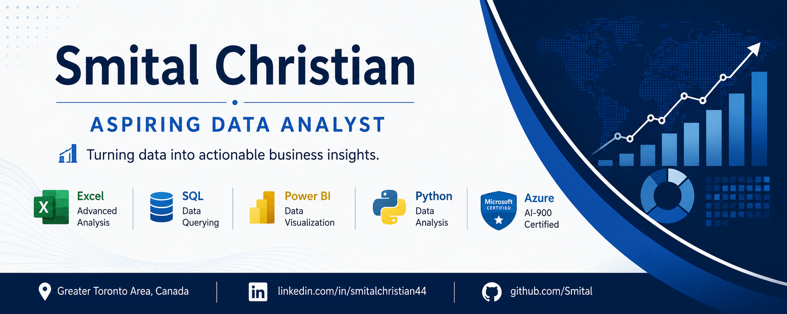

  

## Aspiring Data Analyst

I'm passionate about transforming data into actionable business insights through analytics and visualization.

## 🛠️ Tech Stack

LinkedIn:
https://www.linkedin.com/in/smitalchristian44/

GitHub:
https://github.com/Smital

---

## 🛠️ Tech Stack

### Data Analytics & Visualization

### Database

### Python & Data

### Tools & Platforms

## Featured Projects

### 🇨🇦 JobScope Canada – Analyst Job Market Intelligence Platform

Built an end-to-end job-market analytics pipeline to collect, clean, analyze, and visualize Canadian job-posting data.

- Processed **340 job postings** using Python and Pandas
- Built a **Bronze–Silver–Gold data pipeline** for raw, cleaned, and analysis-ready data
- Extracted technical skills from job descriptions using **Requests and BeautifulSoup**
- Performed data-quality checks for missing values, duplicates, and record consistency
- Analyzed analyst skill demand, location, and employment type
- Built an interactive **Power BI dashboard** using Power Query and DAX
- Identified **Excel, SQL, Tableau, Python, and Power BI** among the skills appearing in analyst postings

**Technologies:** Python, Pandas, Requests, BeautifulSoup, Power BI, Power Query, DAX, Git, GitHub

🔗 [View Project](https://github.com/Smital/JobScope-Canada-Analyst-Job-Market-Intelligence-Platform)

### 📊 Retail Sales Performance Dashboard

Built an interactive Excel dashboard analyzing **51K+ retail sales transactions** to identify sales trends, profitability, product performance, and regional insights.

**Technologies:** Microsoft Excel, Power Query, PivotTables, PivotCharts

🔗 [View Project](https://github.com/Smital/Retail-Sales-Performance-Dashboard)

### 🗄 SQL Job Market Analysis

Analyzed **700,000+ job postings** using PostgreSQL to identify salary trends, in-demand skills, and hiring patterns.

**Technologies:** PostgreSQL, SQL, JOINs, CTEs, Views, Aggregate Functions

🔗 [View Project](https://github.com/Smital/SQL-Job-Market-Analysis)

---

## Currently Learning

- Advanced SQL
- Power BI
- Python for Data Analytics

---
